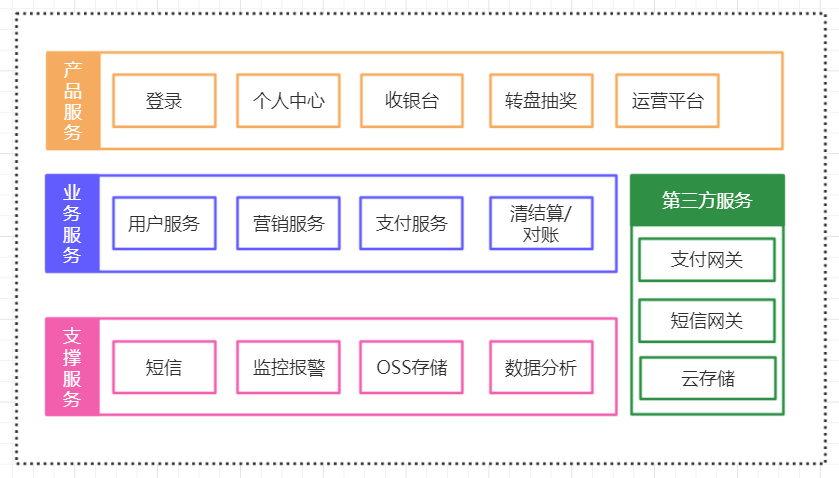

# Gupao-mall

# 架构图

# 代码更新进度

1. 完成单点登录开发

2. 完成转盘抽奖域的设计

# 使用技术
使用Dubbo+spring 构建整个项目

Maven构建项目

Jenkins作为持续集成

使用 Apollo 配置中心

使用Spring+Spring MVC+MyBatisSSM框架

数据库连接池使用druid

数据库使用MySQL和Redis

网页采用Velocity生成静态化页面

采用ElasticSearch实现搜索服务

负载均衡使用Nginx、keepalived实现高可用

消息中间件采用ActiveMQ

在分布式事务上则采用了TCC解决时效性要求性高的分布式事务

可靠的消息服务则来解决时效性要求低的分布式事务.

# 服务列表服务

| 项目      |  描述 | 端口 | 备注  |
| :-------- | --------:| :--: | ---- |
| gpmall-activity | 产品服务子域 转盘抽奖 | 8081 |  转盘抽奖 |
| gpmall-common | 无须运行，直接添加到依赖 |  无  |  公共服务包  |
| gpmall-parent | 父控项目，用来管理mave依赖的jar的版本 | 无 | 父控  |
| gpmall-sso  | 对应产品服务 登录子域,tomcat运行 | 8080 | 登录子域 |
| user-service | 对应核心业务服务子域`用户服务`，dubbo服务 | 20880 | 用户服务 |
|       |     |   |   |
|       |     |   |   |

